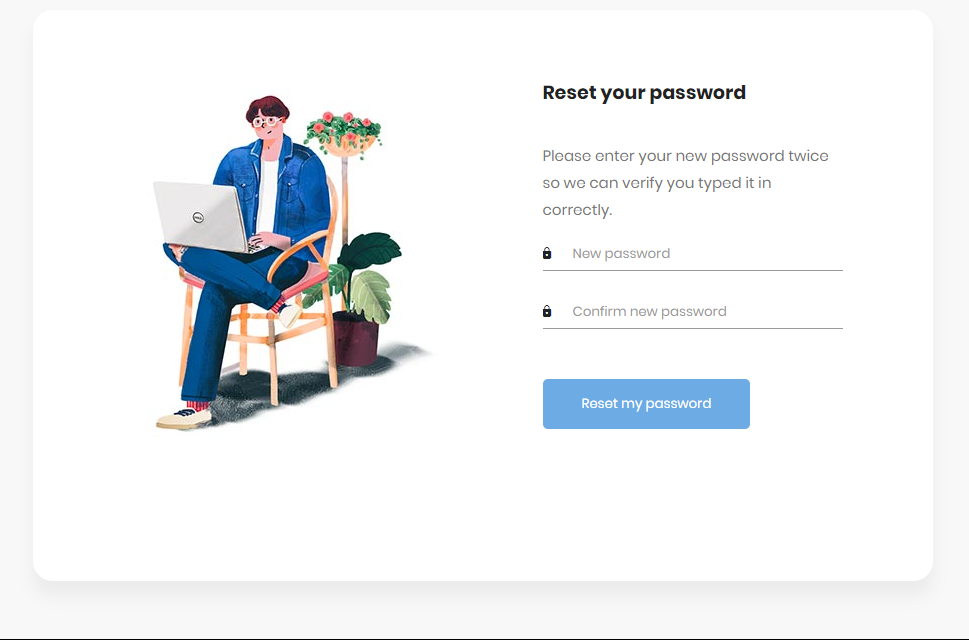

# Django Authentication System

## Features

This project implements a comprehensive authentication system using Django. The key features include:

1. **Django Authentication Framework**: Utilized for user login and registration.
2. **Custom Authentication Backends**: Allows users to log in with their emails.
3. **Django Message Framework**: Provides feedback to users during authentication processes.
4. **Django Auth Views**: Manages password changes and resets.
5. **Django Email Feature**: Sends email notifications for password reset and other authentication-related actions.


## Installation

To run this project locally, follow these steps:

1. **Clone the repository:**

    ```bash
    git clone https://github.com/meenphilip/Authify.git
    ```

2. **Create a virtual environment:**

    ```bash
    python -m venv venv
    source venv/bin/activate  # On Windows use `venv\Scripts\activate`
    ```


3. **Apply migrations:**

    ```bash
    python manage.py migrate
    ```

4. **Create a superuser:**

    ```bash
    python manage.py createsuperuser
    ```

5. **Run the development server:**

    ```bash
    python manage.py runserver
    ```

6. **Access the application:**

    Open your web browser and go to `http://127.0.0.1:8000/`.

## Usage

- **Login and Registration**: Users can sign up and log in using their email addresses.
- **Password Management**: Users can change their passwords and reset them if forgotten.
- **User Feedback**: The application uses the Django message framework to provide feedback during the authentication process.

## Screenshots

Below are some screenshots of the key pages in the authentication system:


## Screenshots

| Login Page | Register Page |
|---|---|
|  |  |
| Home Page | Change Password Page |
|  |  |
| Forgot Password Page | Reset Password Page | 
|  |  |


